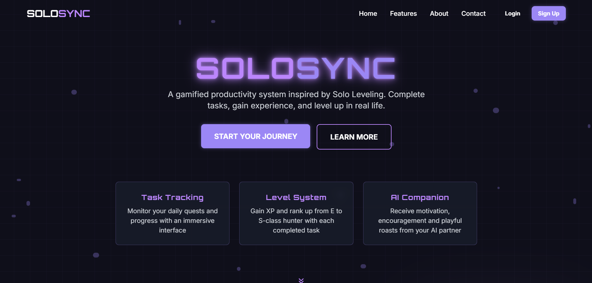

**Welcome to SOLOSYNC**

HERE YOU CAN LEVEL FOR WHO YOU ARE MEANT TO BE!!!

**Arise: A Not-So-Typical To-Do App**

This project began the way many do: I was bored, watching Sung Jinwoo kick butt, and thought, "What if my to-do list felt more like that?"
So, I built this. It's my take on turning the daily grind into a grand quest.

**Live Application:** [**SOLO SYNC**](https://solo-quest-sync-1mjdu6i00-pranav-jais-projects.vercel.app/)

**USEAGE** 




The only requirement is having Node.js & npm installed - [install with nvm](https://github.com/nvm-sh/nvm#installing-and-updating)

Follow these steps:

```sh
# Step 1: Clone the repository using the project's Git URL.
git clone https://github.com/Jaiguruu/solo-quest-sync

# Step 2: Navigate to the project directory.
cd solo-quest-sync

# Step 3: Install the necessary dependencies.
npm i

# Step 4: Start the development server with auto-reloading and an instant preview.
npm run dev
```

**Edit a file directly in GitHub**

- Navigate to the desired file(s).
- Click the "Edit" button (pencil icon) at the top right of the file view.
- Make your changes and commit the changes.

**Use GitHub Codespaces**

- Navigate to the main page of your repository.
- Click on the "Code" button (green button) near the top right.
- Select the "Codespaces" tab.
- Click on "New codespace" to launch a new Codespace environment.
- Edit files directly within the Codespace and commit and push your changes once you're done.

## What technologies are used for this project?

This project is built with:

- Vite
- TypeScript
- React
- shadcn-ui
- Tailwind CSS


